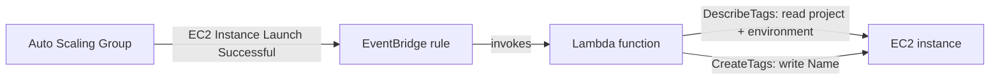

# christen

Automatically apply Name tags to instances in an ASG based on their custom
tags.

Names that appear in the AWS console beside EC2 instances are set by
creating a special tag `Name`.  When members of an ASG start, they are not
given any names, so often what happens is that instance is allowed to
name itself inside of user data.  However, if user data fails for any
reason, the instance will never name itself and it can be difficult to
find the instance's purpose in the AWS console.

The issue with an instance naming itself is that the instance profile (and
underlying IAM role) provides the instance with the `ec2:CreateTags`
permission, which cannot have a scoped `Resource` declaration.  This
violates least privilege and provides the instance with the ability to
create (and overwrite) tags on any instance in the same AWS account.

This project creates an EventBridge rule (formerly CloudWatch Events) that
watches for AutoScaling events, specifically the successful launch of new
EC2 instances, and names them based on their tags.  Thus, only the Lambda
function that backs the rule has the ability to name EC2 instances, and
only in a specific format.

That function's own permission is itself scoped: it may write only the
`Name` tag, and only to instances in its own account.  It cannot touch any
other tag, so concentrating the permission here does not simply move the
over-permission from the instances to the function.

## How It Works



A new instance starts with no `Name` tag.  When the auto-scaling group
finishes launching it, the rule matches the resulting event, the Lambda
function reads the instance's existing tags, and writes back a `Name` built
from them.  If the instance already has a non-empty `Name`, it is left
alone.

## Costs

The resources created under this CloudFormation template will cost either
very little or nothing.  The only element that costs anything is the
Lambda function, and Amazon has a generous free tier that should cover
just about everyone's use case for this tool, making it free to run.

## Naming Format

The instances are named based on the following convention:

```
<project>-<environment>-<instance_id>
```

The tags `project` and `environment` must be available on the instance and
given a non-empty string value.  The `instance_id` is already known by the
auto-scaling group during launch, so you do not need to provide it.

Both the tag keys and the format are stack parameters, so you can match a
different tagging standard without editing the template:

| Parameter | Default | Purpose |
| --- | --- | --- |
| `ProjectTagKey` | `project` | Tag key supplying `{project}` |
| `EnvironmentTagKey` | `environment` | Tag key supplying `{environment}` |
| `NameFormat` | `{project}-{environment}-{instance_id}` | Shape of the generated name |

The placeholders are roles rather than tag names: `{project}` is the value
of whichever tag `ProjectTagKey` names.  So a team tagging with `service`
and `stage` would deploy with:

```
$ aws cloudformation deploy \
    --template-file cfn-template.yml \
    --stack-name christen \
    --region us-east-1 \
    --capabilities CAPABILITY_NAMED_IAM \
    --parameter-overrides ProjectTagKey=service EnvironmentTagKey=stage
```

A format naming a placeholder that does not exist is refused and logged,
leaving the instance unnamed rather than failing the function.

The `instance_id` is stripped of its `i-` prefix, leaving only the unique
ID.

The resulting name is then limited to 255 characters, as that is the
limit of tag values.

An example of this is, using a project `donny` and environment `staging`
is:

```
donny-staging-029d0202d1a
```

## Requirements

* An Amazon Web Services account
* The AWS CLI, configured with credentials
* Permissions to create AWS resources:

  Specifically: CloudFormation, EventBridge, Lambda, IAM roles

## Deploying

Everything lives in a single CloudFormation template, so deploying is one
command.  Run it in each region where you use auto-scaling groups and want
its members named:

```
$ aws cloudformation deploy \
    --template-file cfn-template.yml \
    --stack-name christen \
    --region us-east-1 \
    --capabilities CAPABILITY_NAMED_IAM
```

That is the whole story if you only use a handful of regions.  You can
also upload `cfn-template.yml` directly in the CloudFormation console.

### Deploying to many regions

If you run auto-scaling groups in many regions, [Task](https://taskfile.dev)
is included as an optional convenience runner.  It is not required to use
this project.

```
$ task --list                       # show available tasks
$ task deploy                       # one region (default: us-east-1)
$ task deploy REGION=eu-west-1 ENVIRONMENT=production
$ task deploy:all                   # every region your account has enabled
```

`task deploy:all` asks your account which regions it has enabled, rather
than carrying a hardcoded list.  That avoids two problems: a list baked
into the repository goes stale every time AWS opens a region, and simply
listing every region does not work either, because opt-in regions are
disabled by default and deploying to one fails.

To deploy somewhere narrower, pin the list:

```
$ task deploy:all REGIONS="us-east-1 eu-west-1"
```

The stack name, environment label, and parameters are all variables at the
top of `Taskfile.yml`, and any of them can be overridden on the command
line as shown above.

## Removing

```
$ aws cloudformation delete-stack --stack-name christen --region us-east-1
```

Or, with Task:

```
$ task delete                       # one region, waits for completion
$ task delete:all                   # every region, does not wait
```

## Development

The Lambda function is defined inline in `cfn-template.yml` so that the
template stays self-contained and deployable in a single command with no
packaging step or S3 staging bucket.

To check the template before deploying:

```
$ task validate                     # aws cloudformation validate-template
$ task lint                         # cfn-lint, if installed
```

`example-payloads/cloudwatch-event.json` contains a real AutoScaling launch
event, which is useful for testing the handler.

## License

tl;dr MIT license.

Please read [LICENSE](LICENSE) to view the license for this project.
